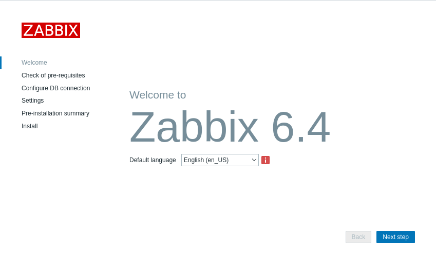

# Install and configure Zabbix

0. [Install PostgreSQL(./PostgreSql/PostgreSql.md)]

[Source: Download and install Zabbix 6.4](https://www.zabbix.com/download?zabbix=6.4&os_distribution=debian&os_version=12&components=server_frontend_agent&db=pgsql&ws=nginx)

1. Install Zabbix repository

```bash
wget https://repo.zabbix.com/zabbix/6.4/debian/pool/main/z/zabbix-release/zabbix-release_6.4-1+debian12_all.deb
dpkg -i zabbix-release_6.4-1+debian12_all.deb
apt update
```
2. Install Zabbix server, frontend, agent

```bash
 apt install zabbix-server-pgsql zabbix-frontend-php php8.2-pgsql zabbix-nginx-conf zabbix-sql-scripts zabbix-agent
```
3. Create initial database

```bash
sudo -u postgres createuser --pwprompt zabbix
sudo -u postgres createdb -O zabbix zabbix
```

4. import initial schema and data

```bash
 zcat /usr/share/zabbix-sql-scripts/postgresql/server.sql.gz | sudo -u zabbix psql zabbix
```

5. Configure the database for Zabbix server

Edit file /etc/zabbix/zabbix_server.conf

```
DBPassword=password
```

7. Configure PHP for Zabbix frontend

Edit file /etc/zabbix/nginx.conf uncomment and set 'listen' and 'server_name' directives.

```
listen 8080;
server_name example.com;
```

8. Start Zabbix server and agent processes

```bash
systemctl enable zabbix-server zabbix-agent php8.2-fpm
systemctl restart nginx
systemctl start zabbix-server zabbix-agent php8.2-fpm
```

9. Show open ports

```bash
netstat -tulpn | grep LISTEN
```

10. Configure Zabbix

[Login and configuring user](https://www.zabbix.com/documentation/6.4/en/manual/quickstart/login)

```
http://localhost:8080
```



11. Login as Zabbix superuser

Enter the **user name** Admin with **password** zabbix to log in as a **Zabbix superuser**.

12. Add new users

## Upgrade procedure

[Upgrade procedure](https://www.zabbix.com/documentation/7.0/en/manual/installation/upgrade)

[Обновление Zabbix 6.0 до 7.0](https://serveradmin.ru/obnovlenie-zabbix-6-0-do-7-0/)

[Source: Download and install Zabbix](https://www.zabbix.com/download?zabbix=7.0&os_distribution=debian&os_version=12&components=server_frontend_agent&db=pgsql&ws=nginx)

1. Remove old (6.4) repository 

```bash
systemctl stop zabbix-server zabbix-agent php8.2-fpm
rm -Rf /etc/apt/sources.list.d/zabbix.list
```

2. Install 7.0 repository

```bash
wget https://repo.zabbix.com/zabbix/7.0/debian/pool/main/z/zabbix-release/zabbix-release_latest_7.0+debian12_all.deb
dpkg -i zabbix-release_latest_7.0+debian12_all.deb
apt update
```

3. Upgrade 6.4 -> 7.0

```bash
apt install --only-upgrade zabbix-server-pgsql zabbix-frontend-php php8.2-pgsql zabbix-nginx-conf zabbix-sql-scripts zabbix-agent
systemctl restart nginx
systemctl start zabbix-server zabbix-agent php8.2-fpm
tail -f /var/log/zabbix/zabbix_server.log

 10491:20250604:214550.018 completed 99% of database upgrade
 10491:20250604:214550.032 completed 100% of database upgrade
 10491:20250604:214550.052 database upgrade fully completed
```

 View Zabbix server uncomment parameters:
 ```bash
 cat zabbix_server.conf | grep -v '^\s*$\|^\s*\#'
 ```

Надо сохранить настройки соединения с БД в файле /etc/zabbix/zabbix_server.conf. Иначе получим такую ошибку:

```
The Zabbix database version does not match current requirements. Your database version: 6040000. Required version: 7000000. Please contact your system administrator.
```

4. Проверяем подключение к UI Zabbix и удаляем установочный файл

```bash
rm zabbix-release_latest_7.0+debian12_all.deb
```

### WebDriver

В конфиге добавился раздел "Browser monitoring".

## Database creation

[Database creation](https://www.zabbix.com/documentation/current/en/manual/appendix/install/db_scripts)

[Создание базы данных](https://www.zabbix.com/documentation/7.0/ru/manual/appendix/install/db_scripts)

Создать базу данных zabbix:
```bash
sudo -i -u postgres
createdb -O zabbix -E Unicode -T template0 zabbix
```

### RHEL packages

zabbix-sql-scripts-7.0.11-release1.el8.noarch.rpm

Extract an RPM package without installing:

```bash
rpm2cpio packagename.rpm | cpio -idmv
```

cpio arguments:

-i = extract
-d = make directories
-m = preserve modification time
-v = verbose

 ## Web interface

 [Web interface installation](https://www.zabbix.com/documentation/current/en/manual/installation/frontend)

 [Установка веб-интерфейса](https://www.zabbix.com/documentation/7.0/ru/manual/installation/frontend)
 
### FastCGI Process Manager php-fpm

[FastCGI Process Manager (FPM)](https://www.php.net/manual/en/install.fpm.php)

[Configuration](https://www.php.net/manual/en/install.fpm.configuration.php)

```bash
find /etc -name "php.ini"
/etc/php/8.2/cli/php.ini
/etc/php/8.2/fpm/php.ini
```

Old Red Hat
```
/etc/php.ini
```

For debug change
```
display_errors = Off
```

to

```
display_errors = On
display_startup_errors = On
error_reporting = E_ALL & ~E_DEPRECATED & ~E_STRICT
```

and restart service php-fpm (php8.2-fpm.service).

```bash
systemctl list-units -t service | grep php
  php8.2-fpm.service                 loaded active running The PHP 8.2 FastCGI Process Manager

systemctl restart php8.2-fpm.service
``

[PHP display_errors](https://www.php.net/manual/ru/errorfunc.configuration.php#ini.display-errors)

```
; This directive controls whether or not and where PHP will output errors,
; notices and warnings too. Error output is very useful during development, but
; it could be very dangerous in production environments. Depending on the code
; which is triggering the error, sensitive information could potentially leak
; out of your application such as database usernames and passwords or worse.
; For production environments, we recommend logging errors rather than
; sending them to STDOUT.
; Possible Values:
;   Off = Do not display any errors
;   stderr = Display errors to STDERR (affects only CGI/CLI binaries!)
;   On or stdout = Display errors to STDOUT
; Default Value: On
; Development Value: On
; Production Value: Off
; https://php.net/display-errors
display_errors = Off
```

**stderr = Display errors to STDERR (affects only CGI/CLI binaries!)**

Permissions:
```
ls -l /etc/zabbix
-rw-r--r-- 1 root     root  1979 Aug 25  2024 nginx.conf
-rw-r--r-- 1 root     root   564 Aug 19  2024 php-fpm.conf
drwxr-xr-x 2 www-data root  4096 Aug 25  2024 web
-rw-r--r-- 1 root     root 17274 May 20 17:39 zabbix_agentd.conf
drwxr-xr-x 2 root     root  4096 Aug 19  2024 zabbix_agentd.d
-rw------- 1 root     root 30496 Jun  4 21:44 zabbix_server.conf
-rw------- 1 root     root 30508 Jun 20 21:37 zabbix_server.conf.dpkg-dist

ls -l /etc/zabbix/web
-rw------- 1 www-data www-data 1909 Aug 25  2024 zabbix.conf.php
```

Nginx balancer:
```
upstream php {
    server  127.0.0.1:9000;
    server  127.0.0.1:9001;
    server  127.0.0.1:9002;
    server  127.0.0.1:9003;
}

location ~ \.php$ {
    try_files  $uri = 404;
    fastcgi_pass  php;
    fastcgi_index  index.php;
    include  fastcgi.conf;
}
```

[PHP-FPM. Установка и настройка](https://tokmakov.msk.ru/blog/item/777) **php-fpm & nginx**

## ToDo:

- Study WebDriver
   * [WebDriver](https://www.selenium.dev/documentation/webdriver/)
   * [WebDriver](https://developer.mozilla.org/en-US/docs/Web/WebDriver)
   * [Selenium](https://ru.wikipedia.org/wiki/Selenium)
   * [Что такое Selenium WebDriver?](https://habr.com/ru/articles/152971/)

- Add TimescaleDB
   [TimescaleDB setup](https://www.zabbix.com/documentation/6.4/en/manual/appendix/install/timescaledb)

- Configure Geomap
   [Geomap](https://www.zabbix.com/documentation/current/en/manual/web_interface/frontend_sections/dashboards/widgets/geomap)

   [Памятник Якову Дьяченко](https://2gis.ru/khabarovsk/geo/4926507877138434/135.051177%2C48.473923?m=135.053663%2C48.473332%2F18) 48.473923° 135.051177°

 - Install Grafana

 - Setup HTTPS

 - Setup NTP

 - Study Nginx

## HTML Tidy

[HTML Tidy](https://ru.wikipedia.org/wiki/HTML_Tidy)

[libtidy-5.6.0-5.el8.x86_64.rpm](https://rhel.pkgs.org/8/epel-x86_64/libtidy-5.6.0-5.el8.x86_64.rpm.html)

&#9635;
